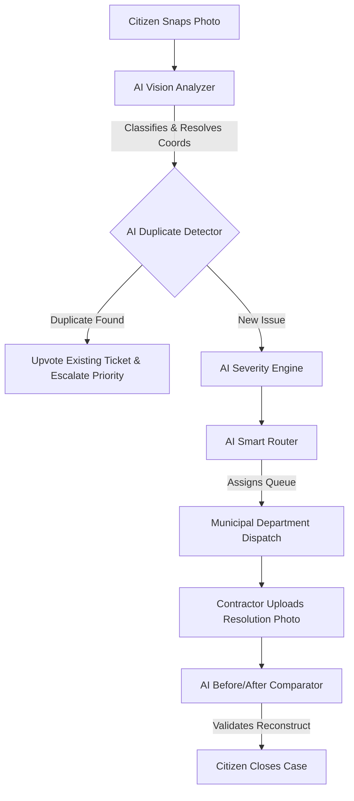

# 🏛️ CivicFix — AI-Powered Citizen Intelligence & Resolution Registry

[](https://civic-fix-mu.vercel.app/)
[](https://civic-fix-mu.vercel.app/)
[](https://civicfix-nthd.onrender.com)
[](https://civic-fix-mu.vercel.app/)

> **"See a problem. Verify it. Fix it. Prove it."**  
> CivicFix is an enterprise-grade, closed-loop civic intelligence platform. It converts raw, unstructured citizen observations into verified, deduplicated, prioritized, and dynamically-routed municipal actions, backed by comparative before/after AI verification.

---

## 🔗 Live Production Links
*   **Web Client (Vercel)**: [https://civic-fix-mu.vercel.app/](https://civic-fix-mu.vercel.app/)
*   **API Gateway (Render)**: [https://civicfix-nthd.onrender.com](https://civicfix-nthd.onrender.com/)
*   **Interactive Swagger Documentation**: [https://civicfix-nthd.onrender.com/docs](https://civicfix-nthd.onrender.com/docs)

---

## 🚨 The Problem: The Municipal Triage Bottleneck & The Human Cost

### The Human Cost: Lethal Hazards
Civic infrastructure failures are not merely visual inconveniences; they are active, real-world safety hazards. 
*   **Potholes & Cavities**: An unmarked pothole on a high-speed road forces two-wheeler riders to swerve violently, leading to fatal crashes.
*   **Exposed Utility Wires**: Dangling live electrical cables near public paths or schools create silent, lethal electrocution traps, especially during monsoons.
*   **Broken Streetlights**: Dark spots on pedestrian crossings increase vehicular collisions and elevate neighborhood crime rates.

**One verified, timely report of a flickering streetlight or road cavity does not just repair asphalt; it directly prevents a fatal accident and saves a human life.**

### The Administrative Bottleneck
Despite this gravity, modern municipal administrations are crippled by critical operational bottlenecks:

*   **The Fragmented Reporting Trap**: Citizens flag city issues across disjointed channels—social media, phone calls, and static web forms. These reports are often vague (e.g., *"pothole on Main St"*), lack precise coordinates, and require manual human triage.
*   **The Duplicate Report Avalanche**: When a high-traffic road develops a pothole, hundreds of citizens report the same issue. Municipal databases get flooded with duplicate tickets, burying other critical reports (like exposed wires or gas leaks) under administrative noise.
*   **The Inspection and Trust Gap**: City workers waste massive resources conducting field visits to verify issues that are either fake, mislocated, or already resolved. Conversely, citizens feel their reports disappear into a "black hole," degrading public trust in local government.
*   **The Resolution Loophole**: Contractors frequently mark tickets as "Resolved" without concrete proof, leading to sub-par repairs, recurring issues, and fraudulent invoice closures.

---

## 💡 The Solution: CivicFix

CivicFix transforms municipal operations by replacing manual triage with **six integrated AI agents** in an **Evidence-First design**:



### Key Pillars
1.  **Evidence-First Submission**: Citizens capture an incident. The system automatically extracts location metadata and categorizes the ticket using computer vision, preventing incorrect manual entry.
2.  **GIS-Driven Deduplication**: Cross-checks nearby reports before submission to combine duplicates into a single ticket, allowing users to "Support" an existing issue instead of spamming the database.
3.  **Dynamic Escalation**: Prioritizes issues based on hazard levels, proximity to public schools/hospitals, and community support signals.
4.  **Closed-Loop Resolution Verification**: Requires contractors to submit visual proof of repairs. The system performs visual comparison audits to confirm work completion before the ticket can be closed.

---

## 🔬 Under the Hood: The Core AI Modules

### 1. Multimodal Vision Analyzer (`vision_analyzer.py`)
Processes user uploads to extract structured civic data:
*   **API Model (Gemini 2.5 Flash)**: Sends images and user-entered descriptions to classify the issue into categories (e.g., *Exposed Wire*, *Pothole*, *Water Leakage*, *Lost and Found*), identifying hazards and severity.
*   **Local YOLO Fallback (`yolo11n.pt`)**: If the API is offline or keyless, the system automatically downloads the `yolo11n.pt` weights and loads the model locally using `ultralytics`. It detects physical objects (such as traffic signs, poles, vehicles, animals, bags) and couples it with a regex keyword matcher to classify the ticket.

### 2. Spatial & Visual Duplicate Detector (`duplicate_detector.py`)
Scans active issues within a 150m radius to correlate reports:
*   **Geospatial Distance (Haversine Formula)**: Compares coordinates using:
    $$\Delta\sigma = 2 \arcsin\left(\sqrt{\sin^2\left(\frac{\Delta\phi}{2}\right) + \cos(\phi_1)\cos(\phi_2)\sin^2\left(\frac{\Delta\lambda}{2}\right)}\right)$$
    $$d = R \cdot \Delta\sigma$$
    Where $R = 6,371,000\text{ meters}$. If $d > 150\text{ meters}$, the issue is skipped.
*   **Semantic Text Analysis (TF-IDF + Cosine Similarity)**: Converts descriptions into term-frequency vectors and calculates:
    $$\text{Similarity} = \cos(\theta) = \frac{\mathbf{A} \cdot \mathbf{B}}{\|\mathbf{A}\| \|\mathbf{B}\|}$$
*   **Visual Image Correlation (dHash + Hamming Distance)**:
    1. Grayscales the image and downsamples it to a $9\times8$ grid.
    2. Computes the difference between horizontally adjacent pixels to generate a 64-bit binary matrix.
    3. Calculates visual similarity based on the Hamming distance (bit difference). visually identical items (such as the same lost handbag) trigger correlation warnings.

### 3. Dynamic Priority & Severity Engine (`severity_engine.py`)
Determines the urgency score $S \in [0.0, 1.0]$:
*   **Base Weight ($W_b$)**: Derived from AI classification (e.g., *Exposed Wire* = 0.8, *Pothole* = 0.6, *Lost and Found* = 0.2).
*   **Support Weight ($W_s$)**: Scaled logarithmically by community upvotes:
    $$W_s = \min(0.2, 0.05 \cdot \ln(1 + \text{supports}))$$
*   **Density Weight ($W_d$)**: Scaled by the density of similar issues within the ward:
    $$W_d = \min(0.15, 0.03 \cdot \text{duplicates})$$
*   **Total Score**:
    $$S = \min(1.0, W_b + W_s + W_d)$$
    This score is mapped to priority tiers: Low ($<0.4$), Medium ($0.4 - 0.6$), High ($0.6 - 0.8$), and Critical ($\ge0.8$).

### 4. Smart Routing Engine (`routing_engine.py`)
*   Assigns the ticket to the correct municipal agency (e.g., *Electricity Board* for exposed wires, *Road Authority* for potholes, *Water Board* for leaks) and locates the appropriate ward supervisor.

### 5. Resolution Image Comparator (`resolution_comparator.py`)
*   Compares the original "Before" image with the contractor's uploaded "After" image. It analyzes color histogram distribution shifts and structural similarity index (SSIM) to verify that the repair is physically complete (e.g., the pothole has been covered with asphalt).

### 6. Conversational Chatbot Assistant (`chatbot.py`)
*   An interactive helper that lets users report issues, check case statuses, or locate nearby hazards in natural language.

---

## 📡 REST API Reference

| Endpoint | Method | Auth | Description |
| :--- | :--- | :--- | :--- |
| `/api/auth/signup` | `POST` | Public | Register a new user profile (Citizen, Operator, Admin). |
| `/api/auth/login` | `POST` | Public | Login gateway supporting both email and username. |
| `/api/auth/me` | `GET` | Bearer | Retrieve details of the current logged-in user. |
| `/api/issues` | `GET` | Public | Retrieve a list of active issues (filters: ward, status, category). |
| `/api/issues` | `POST` | Bearer | Report a new issue (form-data: title, desc, coords, photo). |
| `/api/issues/check-duplicates` | `POST` | Bearer | Query duplicate detector with photo, coords, and description. |
| `/api/issues/{id}` | `GET` | Public | Fetch detailed audit logs, upvotes, history, and photos for a case. |
| `/api/issues/{id}/status` | `PATCH` | Bearer | Transition issue status (e.g. `IN_PROGRESS`). |
| `/api/issues/{id}/resolve` | `POST` | Operator | Upload resolution proof photo and notes to mark `RESOLVED`. |
| `/api/issues/{id}/verify` | `POST` | Reporter | Citizen verification of resolution to close/reopen ticket. |
| `/api/analytics/dashboard` | `GET` | Public | Retrieve system-wide statistics (trends, categories, priorities). |
| `/api/analytics/hotspots` | `GET` | Public | Run DBSCAN spatial clustering to retrieve city hotspots. |
| `/api/assistant` | `POST` | Bearer | Query conversational chatbot with geolocation context. |

---

## 🎨 Frontend Design & Architecture

The user interface uses a **Deep Midnight Glassmorphism** design language inspired by modern SaaS applications:

*   **Color System**: Midnight base (`hsl(222, 47%, 4%)`) paired with royal accents (`hsl(263, 90%, 50%)`) and vibrant alert indicators.
*   **Bespoke SVG Charts**: Standard ChartJS/React canvas libraries often crash or fail to resize correctly inside responsive CSS grids. CivicFix uses **custom-engineered SVG React components** to render clean, interactive charts:
    *   *Category Load*: Rounded SVG column bars.
    *   *Weekly Trends*: Gradient-filled bezier wave paths.
    *   *Priority Load*: Dynamic percentage progress tracks.
*   **Voyager GIS mapping**: The Leaflet map uses the high-contrast **CartoDB Voyager** tile layer, rendering road details, municipal boundaries, and hotspot clusters in a clean, readable format.

---

## 🚀 Local Installation & Set-Up

### Prerequisites
*   Node.js (v18+)
*   Python (3.10+)

### 1. Backend Server Setup
Navigate to the root directory:
```bash
# Set up a virtual environment (optional)
python -m venv venv
source venv/bin/activate # On Windows: venv\Scripts\activate

# Install python dependencies
pip install -r backend/requirements.txt

# Seed the SQLite database with mock cases
python -m backend.app.seed

# Launch the dev server
python -m uvicorn backend.app.main:app --reload --port 8000
```
*API docs will be available at `http://localhost:8000/docs`.*

### 2. Frontend Development Setup
Navigate to the frontend folder:
```bash
cd frontend
npm install
npm run dev
```
*Open `http://localhost:5173` in your browser.*

---

## 📦 Container Deployment (Docker)

To run the entire system locally in production mode (compiled React static build served via **Nginx** + **Uvicorn** API gateway):
```bash
docker-compose up --build -d
```
*   **Web Client URL**: `http://localhost` (Port 80)
*   **API Gateway URL**: `http://localhost:8000`

---

## ⚡ Demo Walkthrough Script

Verify the closed-loop features of the application using this scenario:

1.  **Sandbox Login**: Open [https://civic-fix-mu.vercel.app/](https://civic-fix-mu.vercel.app/). Click the **Citizen** sandbox card to log in instantly as `Satwik`.
2.  **File a Report**: Click **"Report a Civic Problem"**.
    *   Select **Enter Address Manually**.
    *   Type `Gandhinagar, Vellore` *(This auto-resolves to Ward 7 coordinates in the background).*
    *   Upload an image, type *"Pothole on road"*, and click **Run AI Triage**.
3.  **Verify Duplicate Detection**: The AI duplicate detector will locate `CIV-28491` (already reported 0m away), display a side-by-side card with the matching photo, and suggest you upvote it. Click **"Support Existing Issue"**.
4.  **Triage as Operator**: Click **Log Out**, and click the **Authority Operator** sandbox card to log in. 
5.  **Review the Dashboard**: Access the **Dashboard** view to view SVG trend graphs and see the prioritized queue.
6.  **Progress Case**: Open the details for case `CIV-28491` in the queue. Click **Start Work** (sets status to `IN_PROGRESS`).
7.  **Submit Resolution**: Click **Resolve Case**, type *"Asphalt laid and rolled flat"*, upload a photo, and submit. The backend runs the before/after image comparison.
8.  **Citizen Closure**: Log back in as the Citizen. Open the details for `CIV-28491`. You will see the **Before/After verification slider**. Move the slider to inspect the repair, then click **Yes, Fixed** to close the ticket!
