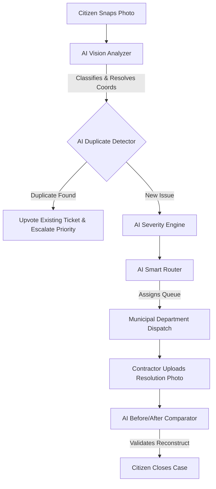

# 🏛️ CivicFix — AI-Powered Citizen Intelligence & Resolution Registry

[](file:///d:/CivicFix/README.md)
[](file:///d:/CivicFix/README.md)
[](file:///d:/CivicFix/README.md)
[](file:///d:/CivicFix/README.md)

> **"See a problem. Verify it. Fix it. Prove it."**
> CivicFix is an enterprise-grade, closed-loop civic intelligence platform. It converts raw, unstructured citizen observations into verified, deduplicated, prioritized, and dynamically-routed municipal actions, backed by comparative before/after AI verification.

---

## 🚨 The Problem: The Municipal Triage Bottleneck & The Human Cost

Civic infrastructure failures are not merely visual inconveniences; they are active, real-world safety hazards. An unmarked pothole on a high-speed road, a dangling exposed electrical cable near a school, or a dark, non-functional streetlight on a pedestrian crossing are lethal hazards. **One verified, timely report of a flickering streetlight or road cavity does not just repair asphalt; it directly prevents a fatal accident and saves a human life.**

Yet, modern municipal administrations face critical operational bottlenecks:

*   **The Fragmented Reporting Trap**: Citizens flag city issues across disjointed channels—social media, phone calls, and static web forms. These reports are often vague (e.g., *"pothole on Main St"*), lack precise coordinates, and require manual human triage.
*   **The Duplicate Report Avalanche**: When a high-traffic road develops a pothole, hundreds of citizens report the same issue. Municipal databases get flooded with duplicate tickets, burying other critical reports (like exposed wires or gas leaks) under administrative noise.
*   **The Inspection and Trust Gap**: City workers waste massive resources conducting field visits to verify issues that are either fake, mislocated, or already resolved. Conversely, citizens feel their reports disappear into a "black hole," degrading public trust in local government.
*   **The Resolution Loophole**: Contractors frequently mark tickets as "Resolved" without concrete proof, leading to sub-par repairs, recurring issues, and fraudulent invoice closures.

---

## 💡 The Solution: CivicFix

CivicFix transforms municipal operations by replacing manual triage with **six integrated AI agents** in an **Evidence-First design**:



1.  **AI Vision Triage**: Citizen uploads an image $\to$ AI automatically extracts the category, hazards, and base severity.
2.  **GIS-Driven De-duplication**: Auto-checks proximity (Haversine distance) and text/image similarities, suggesting upvotes instead of filing duplicates.
3.  **Dynamic Priority Escalation**: Raises severity automatically if community votes or report densities surge.
4.  **Closed-Loop Resolution Verification**: Forces contractors to upload resolution photos, running pixel-level comparisons to confirm the repair is complete.

---

## 🛠️ The Core AI Modules (How They Work)

### 1. Multimodal Vision Analyzer (`vision_analyzer.py`)
*   **Gemini 2.5 Flash Integration**: Parses user photos and descriptions to return structured JSON mapping the category, objects, hazards, and confidence levels.
*   **Resilient YOLO Fallback**: If offline or keyless, the system lazy-loads a local object detection model (`yolo11n.pt`) and maps classifications using a text keyword engine.

### 2. Spatial & Visual Duplicate Detector (`duplicate_detector.py`)
*   **Haversine Spatial Proximity**: Compares coordinate locations to filter issues reported within 150 meters.
*   **Text TF-IDF Vectorization**: Runs a cosine-similarity check on ticket descriptions to detect matching topics.
*   **Visual dHash Matching**: Computes a 64-bit Horizonal Difference Hash (dHash) of the image, calculating the Hamming distance between canvas states to identify matching items (like the same lost purse).

### 3. AI Dynamic Severity Engine (`severity_engine.py`)
*   Automatically scores and escalates priority (Low $\to$ Medium $\to$ High $\to$ Critical) by combining **Vision Classification hazards**, **Community Signal counts**, and **Regional Report Density** within the ward.

### 4. Smart Routing Engine (`routing_engine.py`)
*   Parses the category and neighborhood ward to auto-assign cases to specific public department queues (e.g. *Road Authority*, *Water & Sanitation*, *Lost & Found Registry*), eliminating manual dispatch delay.

### 5. Resolution Image Comparator (`resolution_comparator.py`)
*   Compares the original "Before" image against the contractor's uploaded "After" image to verify structural differences (such as confirming a pothole was filled with flat asphalt), preventing premature or fake ticket closures.

### 6. Conversational Chatbot Assistant (`chatbot.py`)
*   A responsive helper that allows citizens to report issues conversationally, check ticket statuses, or query nearby alerts.

---

## 💻 Tech Stack

### Frontend
- **Framework**: React 18, Vite 8, ES6 JavaScript.
- **Styling**: Pure CSS utilizing modern variables, glassmorphism UI containers, and CSS grid viewport sizing.
- **GIS Mapping**: Leaflet.js mapped over high-legibility **CartoDB Voyager** maps.
- **Visuals**: Bespoke interactive React SVG charts (Weekly Trends, Priority Distributions).

### Backend
- **Framework**: Python 3.10, FastAPI, SQLAlchemy ORM.
- **Database**: SQLite3.
- **Authentication**: JWT (JSON Web Tokens) with a dual credential gateway (accepting username or email).

---

## 🚀 Getting Started

### Local Setup
Ensure you have Node.js (v18+) and Python (3.10+) installed.

1.  **Clone the Repository** and navigate to the project directory:
    ```bash
    cd CivicFix
    ```
2.  **Start the Backend**:
    ```bash
    # Seed the database
    python -m backend.app.seed
    
    # Run FastAPI server
    python -m uvicorn backend.app.main:app --reload --port 8000
    ```
    *API documentation will be accessible at `http://localhost:8000/docs`.*

3.  **Start the Frontend**:
    ```bash
    cd frontend
    npm install
    npm run dev
    ```
    *Open `http://localhost:5173` in your browser.*

### Production Container Deployment (Docker)
Build and deploy the full stack in production mode (FastAPI Uvicorn server + built frontend served on **Nginx**):
```bash
docker-compose up --build -d
```
*   **Frontend web client**: `http://localhost` (Port 80)
*   **Backend server**: `http://localhost:8000`

---

## ⚡ Demo Walkthrough Script (For Judges)

Test the closed-loop integrity of the app using these steps:
1.  **Instant Sandbox Login**: On the landing page, click the **Citizen** sandbox card (logged in as `Satwik`).
2.  **Report a Civic Issue**: Click "Report a Civic Problem". Toggle GPS off, type `Gandhinagar, Vellore`, write *"Pothole on road"* and click **Run AI Triage**.
3.  **Duplicate Correlation**: The AI will detect a matching pothole already reported 0m away and suggest you upvote it instead of filing a duplicate.
4.  **Triage to Operator**: Click "Log Out", and click the **Authority Operator** sandbox card (logged in as `operator`). Access the **Dashboard** to see the high-priority queue.
5.  **Fixing and Closing**: Open the assigned case, change the status to "In Progress", upload a resolution picture, and submit. Log back in as a Citizen to verify the before/after slider comparison and close the ticket!
